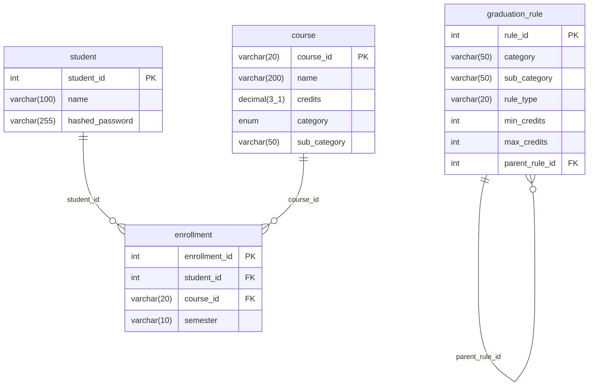

# Entity-Relationship Diagram

_Auto-generated by `python -m scripts.dump_erd`. Do not edit by hand._

## Unique constraints

- `enrollment` unique `uq_student_course_semester`: (student_id, course_id, semester)
